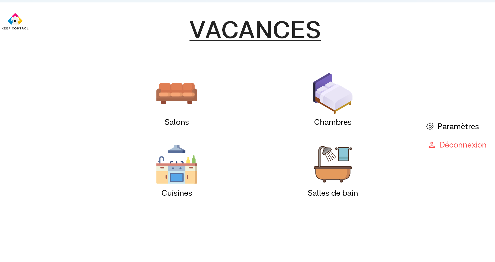

# Domotique-tkinter
Ce projet est une application domotique qui permet de gérer la température et l'éclairage d'une maison. L'application, développée avec Python et customTkinter, fournit une interface graphique permettant à l'utilisateur de visualiser et contrôler l'état des capteurs de température et d'éclairage en temps réel.

Interface d'accueil:

